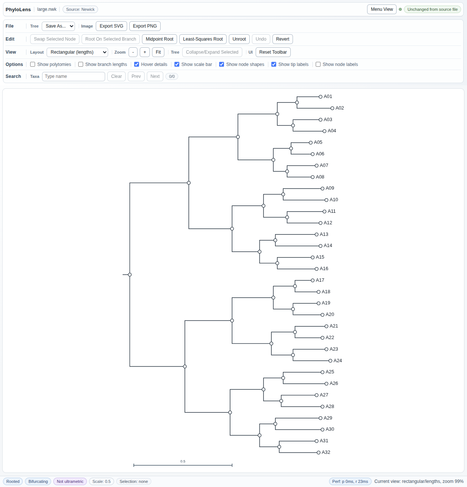
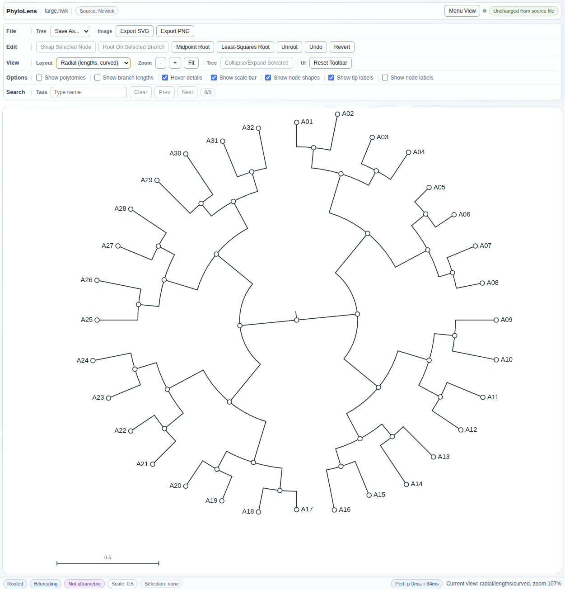
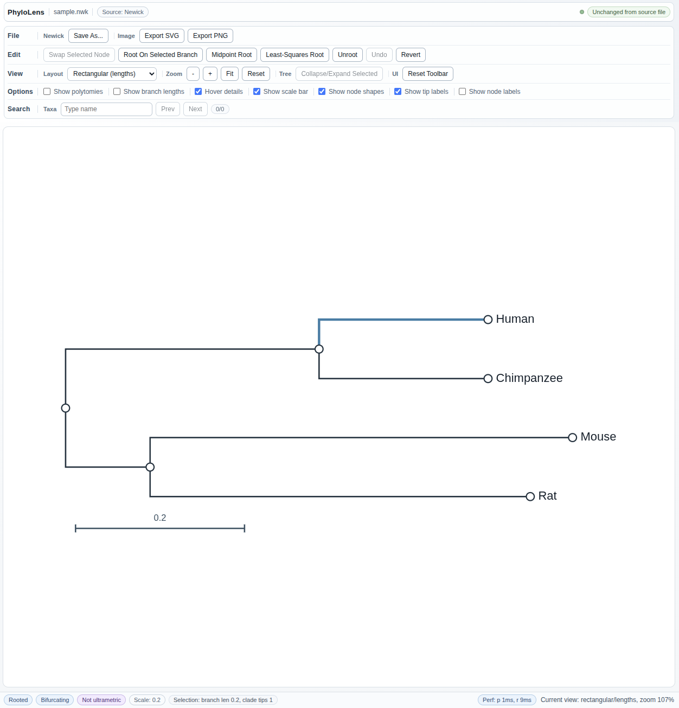
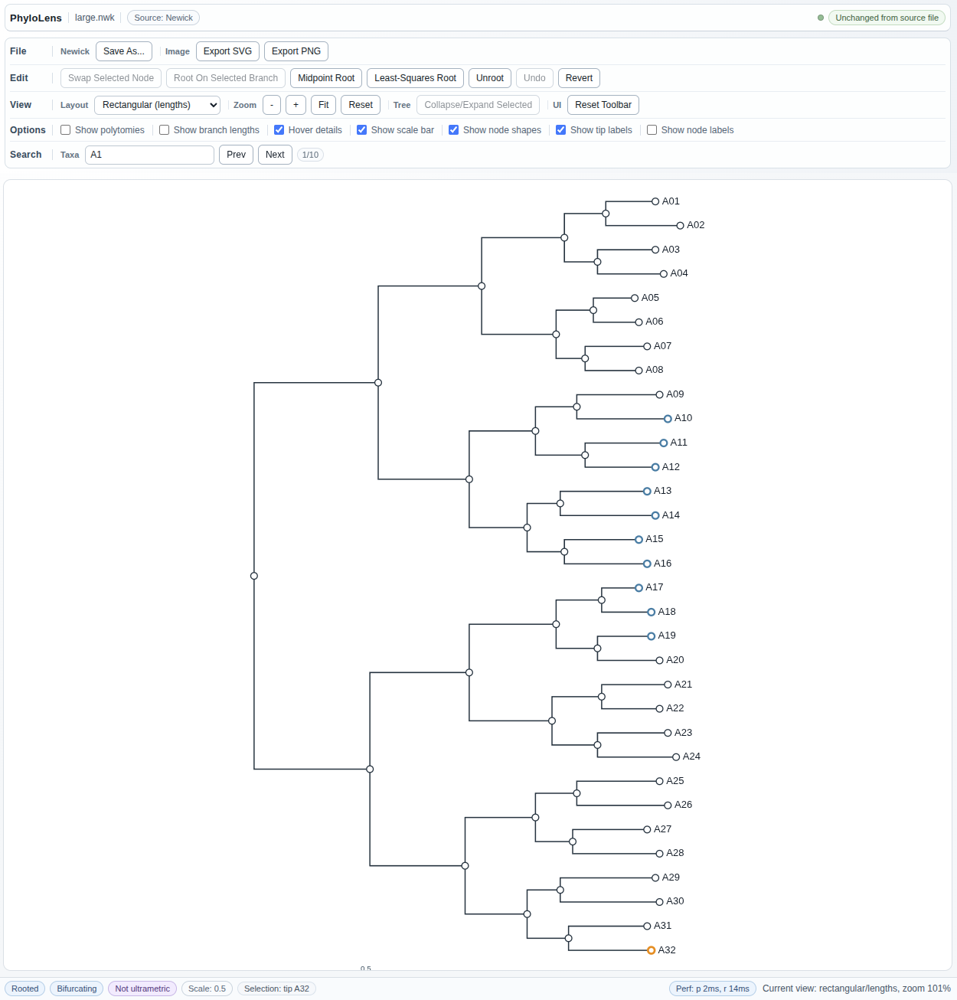

# PhyloLens

PhyloLens is a VS Code extension focused on viewing phylogenetic trees across multiple common formats.

## Disclaimer

This project was developed with significant assistance from a large language model (GPT-5 / Codex).

## What It Does

- Adds an `Open Tree Viewer` button in the editor title for supported tree files.
- Adds `Open Tree Viewer` to Explorer right-click for supported tree files.
- Opens a dedicated tree viewer panel beside your text editor.
- Adds a keyboard shortcut: `Ctrl+Alt+P` (`Cmd+Alt+P` on macOS).
- Tree/source sync: click node/branch in viewer -> reveal source in editor.
- Tree/source sync: move cursor in editor -> highlight corresponding node in viewer.

## Screenshots






## Supported File Types

- `.nwk`
- `.newick`
- `.tree`
- `.tre`
- `.treefile`
- `.nex`
- `.nexus`
- `.phyloxml`
- `.xml` (PhyloXML content)
- `.nexml`

## Viewer Features

- Layouts: `Rectangular (lengths)`, `Rectangular (equal)`, `Radial (lengths, curved)`, `Radial (lengths, straight)`, `Radial (equal, curved)`, `Radial (equal, straight)`.
- Zoom and pan with `+`, `-`, mouse wheel, and drag.
- `Fit` view control (centers/fits tree with overlays visible).
- Scale indicator badge + optional scale bar in-canvas.
- Display toggles include branch lengths, scale bar, tip/internal labels, and node shapes.
- Selection-aware actions: root on selected branch, unroot, swap selected node child order, collapse/expand selected clade.
- Global undo (`Ctrl+Z` / `Cmd+Z`) for tree edits and view changes, plus revert-to-original.
- Save edited tree with `Save As...` in Newick/NEXUS/PhyloXML/NeXML.
- Export rendered tree to `SVG` or `PNG`.
- Search taxon/node labels with `Prev/Next`, `Clear`, and a match counter.
- Branch hover details (length and descendant tip count).

## Metadata Badges

Title row badges show:
- source format
- edit sync status vs loaded source file

Bottom status strip badges show:
- rooted/unrooted
- bifurcating/non-bifurcating
- ultrametric/not ultrametric
- scale value
- performance (parse/render timing)

## Install / Run (Dev)

```bash
npm install
npm run compile
```

Press `F5` in VS Code to launch the Extension Development Host.

## Example Trees

All example trees now live under `examples/`.

Small/base examples:
- `examples/comments.nwk`
- `examples/sample.nexml`
- `examples/sample.nexus`
- `examples/sample.nwk`
- `examples/sample.phyloxml`
- `examples/sample.rooted.nwk`
- `examples/ultrametric.nwk`

Rich metadata examples:
- `examples/rich.nexml`
- `examples/rich.nexus`
- `examples/rich.phyloxml`

Large examples:
- `examples/large.nexml`
- `examples/large.nexus`
- `examples/large.nwk`
- `examples/large.phyloxml`
